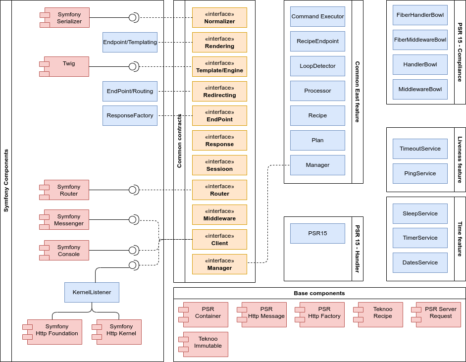
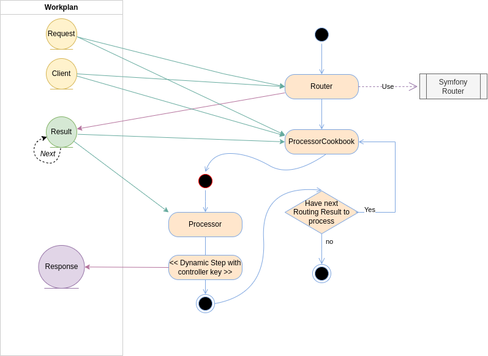

Teknoo Software - East Foundation
=================================

East Foundation is a universal package to implement the [#east](http://blog.est.voyage/phpTour2015/) philosophy with
any framework supporting `PSR 11`, `PSR 7` or with Symfony 6.4+ : All public method of objects must return `$this` or a
new instance of `$this`.

This bundle uses `PSR 7` requests and responses and do automatically the conversion from Symfony's requests and responses.
So your controllers and services can be independent of Symfony. This bundle reuse internally Symfony's components
to manage routes and find controller to call. It is also designed to be used with other framework.

It can be also used for workers :
* Triggering asynchronous tasks for timers (thanks to pcntl, or a cooperative backend, like with FrankenPHP).
* Setting up a worker health check.
* Provides non blocking sleep method.

This library is built on the Recipe library, and redefine only some interfaces to be more comprehensive with HTTP
context :
* Middleware are actions, but must implement a specific interface.
* The HTTP workflow is defined into a Recipe, able to be extended.
* Chef became a manager, to execute the workflow when a request is accepted.
* Usable with any `PSR 11` Framework, Symfony implementation is also provided.
* Supports `PSR 15` handler and middleware
* Supports `PSR 20` and provides a PSR-20 implementation

Architecture
------------
East Foundation is a collection of contracts, recipes and components built on `Teknoo Recipe`, `PSR 7` and `PSR 11`.
It is bundled with a `Symfony Integration`.
It supports also :
* `PSR 15` handler and middleware
* `PSR 20` and provides a `PSR-20` implementation



The `Manager` is a specialization of a `Recipe Chef`, to manage executions of HTTP requests and other messages from 
other channel. It's trained with the plan `Teknoo\East\Foundation\Recipe\Plan` and the default recipe 
`Teknoo\East\Foundation\Recipe\Recipe`. This plan is described in the next section.

Messages and requests can be executed from
- a request passed by the http server or php-fpm. (Default behavior).
- from a message oriented middleware, like RabbitMq or other AMQP implementations, thanks to `Symfony Messenger` 
  - (`Messenger` is not mandatory).
- from a CLI thanks to `Symfony Console`. (Another implementation is allowedd).

This library is able to process any callable endpoint able to create a `PSR7 Response`, endpoints built on recipe
(allowing customizing these recipes without rewrite any components, only with some definitions in the DI container).

It provides also some contracts and default implementation with `Symfony components` like http redirection and server
rendering with `Twig`.

East Foundation provides also a service able to return the current date, as `\DateTimeInterface` instance. Schedule an
action on a timer (with the `pcntl` extension or a cooperative backend, see the next section). And two liveness 
services, to set a catchable timeout (built on the timer, a non catchable fallback with `set_time_limit` is also 
available) and a `PingService` to ensure notifications to a watchdog to prevent kills.

Timer
-----
`Teknoo\East\Foundation\Time\TimerService` (`TimerServiceInterface`) can call a callable within X seconds, without
blocking the current execution, contrary to `sleep`. The call can be executed after X seconds (PHP is monothread) and
can be unregistered before. `Teknoo\East\Foundation\Time\SleepService` is a non blocking sleep built on this timer and
`Teknoo\East\Foundation\Liveness\TimeoutService` uses it to throw a catchable exception when a task is too long.

`TimerService` is a frontal service and delegates to a backend, implementing 
`Teknoo\East\Foundation\Time\Backend\BackendInterface`. The backend is the first backend, in the list passed to the
constructor, where the method `isAvailable()` returns `true`. This choice is done at the first call of `register()` or
`unregister()` and kept until the destruction of the `TimerService` instance (each instance does its own choice).
Two backends are provided :

* `Teknoo\East\Foundation\Time\Backend\Pcntl\TimerService` : built on the `pcntl` extension and the signal `SIGALRM`.
  Calls are executed asynchronously, even during a blocking operation. It is not available on Windows, when `SIGALRM`
  is blocked for the current thread, or with the FrankenPHP SAPI (worker or classic mode) : FrankenPHP blocks
  `SIGALRM` on all its threads (only its `php-cli` command unblocks it) and an alarm is unique for all threads of a
  process.
* `Teknoo\East\Foundation\Time\Backend\Cooperative\TimerService` : available everywhere, without any extension, like
  with FrankenPHP in worker mode. PHP can not interrupt the current execution without signal, so calls are executed 
  only at some checkpoints :
  * at each call to `register()`, 
  * at each tick, thanks to a tick function registered by this backend. Ticks are only emitted by code of files
    declaring `declare(ticks=N);`, like `SleepService`. You can declare ticks in your own files to have expired calls
    executed during your long operations, an exception thrown by a call is propagated into your code, like with
    `pcntl`.
  
  Nothing is executed during a blocking operation (`sleep`, I/O, SQL query, etc.) or in a code without ticks.
  `unregister()` never executes expired calls (it is safe in a destructor). With this backend, the hard limit of
  `TimeoutService` is its fallback with `set_time_limit` (enforced per thread by FrankenPHP on Linux), a fatal error
  will stop the task (and the FrankenPHP worker will be restarted).

With the PHP-DI definitions provided by this library, backends are defined, by priority order, in the entry 
`teknoo.east.foundation.time.timer.backends` (by default only the `pcntl` backend), and the cooperative backend is
defined as the last chance backend in the entry `teknoo.east.foundation.time.timer.fallback_backend`. You can add your
own backend, implementing `BackendInterface`, after the `pcntl` backend with `DI\add()` :

```php
use function DI\add;
use function DI\get;

return [
    'teknoo.east.foundation.time.timer.backends' => add([
        get(MyTimerBackend::class),
    ]),
];
```

Or redefine the entry `teknoo.east.foundation.time.timer.backends` to change the order.

PSR 15
------
East Foundation supports `PSR-15` `RequestHandlerInterface` and `MiddlewareInterface` in a Recipe or a Plan via 
dedicated bowls :
- `HandlerBowl`
- `MiddlewareBowl`
Or, to run a request handler or a middleware in a fiber :
- `FiberMiddlewareBowl`
- `FiberHandlerBowl`

If your framework supports `PSR-15` handler, East Foundation can be used even if no implementation is available for it,
with the embedded `RequestHandler` : `Teknoo\East\Foundation\Http\RequestHandler\PSR15`.

Plan
--------



The first Plan `Teknoo\East\Foundation\Recipe\Plan`, instantiated with an instance of 
`Teknoo\East\Foundation\Recipe\Recipe`. The recipe has only two steps and a loop and the second step :

* the first step is dedicated to the request parsing with a router (by default the `Symfony Router`) to extract
  controllers corresponding to the request and parameters passed in it. The router must create a `Router/Result` 
  instance. This instance can recursively reference more results if several controllers corresponding to the request.
* the second step execute a subplan `Teknoo\East\Foundation\Processor\ProcessorPlan`. This step will be 
  repeated as many times as there are results from the router.
  * The first step in the `ProcessorPlan` will extract the controller from the current result and put it into the
    workplan.
  * It will do the same with parameters from the request or message.
  * The second step of this subrecipe is a dynamic step, executing the dertemined controller fron the request.

Credits
-------
EIRL Richard Déloge - <https://deloge.io> - Lead developer.
SASU Teknoo Software - <https://teknoo.software>

About Teknoo Software
---------------------
**Teknoo Software** is a PHP software editor, founded by Richard Déloge, as part of EIRL Richard Déloge.
Teknoo Software's goals : Provide to our partners and to the community a set of high quality services or software,
sharing knowledge and skills.

License
-------
East Foundation is licensed under the 3-Clause BSD License - see the licenses folder for details.
