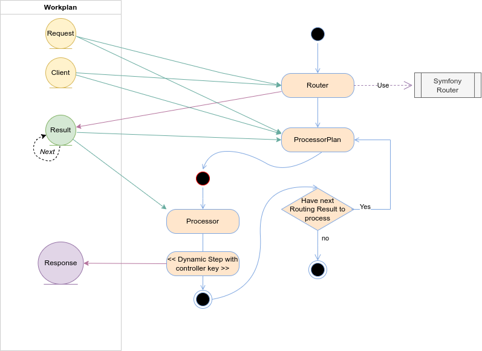

Teknoo Software - East Foundation
=================================

East Foundation is a universal package to implement the [#east](http://blog.est.voyage/phpTour2015/) philosophy with
any framework supporting `PSR 11`, `PSR 7` or with Symfony 6.4+ : All public method of objects must return `$this` or a
new instance of `$this`.

This bundle uses `PSR 7` requests and responses and do automatically the conversion from Symfony's requests and responses.
So your controllers and services can be independent of Symfony. This bundle reuse internally Symfony's components
to manage routes and find controller to call. It is also designed to be used with other framework.

It can be also used for workers :
* Triggering asynchronous tasks (thanks to pcntl) for timers.
* Setting up a worker health check.
* Provides non blocking sleep method.

This library is built on the Recipe library, and redefine only some interfaces to be more comprehensive with HTTP
context :
* Middleware are actions, but must implement a specific interface.
* The HTTP workflow is defined into a Recipe, able to be extended.
* Chef became a manager, to execute the workflow when a request is accepted.
* Usable with any `PSR 11` Framework, Symfony implementation is also provided.
* Supports `PSR 15` handler and middleware
* Supports `PSR 20` and provides a PSR-20 implementation

Architecture
------------
East Foundation is a collection of contracts, recipes and components built on `Teknoo Recipe`, `PSR 7` and `PSR 11`.
It is bundled with a `Symfony Integration`.
It supports also :
* `PSR 15` handler and middleware
* `PSR 20` and provides a `PSR-20` implementation

The `Manager` is a specialization of a `Recipe Chef`, to manage executions of HTTP requests and other messages from 
other channel. It's trained with the cookbook `Teknoo\East\Foundation\Recipe\Cookbook` and the default recipe 
`Teknoo\East\Foundation\Recipe\Recipe`. This cookbook is described in the next section.

Messages and requests can be executed from
- a request passed by the http server or php-fpm. (Default behavior).
- from a message oriented middleware, like RabbitMq or other AMQP implementations, thanks to `Symfony Messenger` 
  - (`Messenger` is not mandatory).
- from a CLI thanks to `Symfony Console`. (Another implementation is allowedd).

This library is able to process any callable endpoint able to create a `PSR7 Response`, endpoints built on recipe
(allowing customizing these recipes without rewrite any components, only with some definitions in the DI container).

It provides also some contracts and default implementation with `Symfony components` like http redirection and server
rendering with `Twig`.

East Foundation provides also a service able to return the current date, as `\DateTimeInterface` instance. Schedule an
action on a timer (need the `pcntl` extension). And two liveness services, to set a catchable timeout (need also the 
`pcntl` extension, but a non catchable fallback with `set_time_limit` is available) and a `PingService` to ensure 
notifications to a watchdog to prevent kills.

PSR 15
------
East Foundation supports `PSR-15` `RequestHandlerInterface` and `MiddlewareInterface` in a Recipe or a Cookbook via 
dedicated bowls :
- `HandlerBowl`
- `MiddlewareBowl`
Or, to run a request handler or a middleware in a fiber :
- `FiberMiddlewareBowl`
- `FiberHandlerBowl`

If your framework supports `PSR-15` handler, East Foundation can be used even if no implementation is available for it,
with the embedded `RequestHandler` : `Teknoo\East\Foundation\Http\RequestHandler\PSR15`.

Cookbook
--------

The first Cookbook `Teknoo\East\Foundation\Recipe\Cookbook`, instantiated with an instance of 
`Teknoo\East\Foundation\Recipe\Recipe`. The recipe has only two steps and a loop and the second step :

* the first step is dedicated to the request parsing with a router (by default the `Symfony Router`) to extract
  controllers corresponding to the request and parameters passed in it. The router must create a `Router/Result` 
  instance. This instance can recursively reference more results if several controllers corresponding to the request.
* the second step execute a subcookbook `Teknoo\East\Foundation\Processor\ProcessorCookbook`. This step will be 
  repeated as many times as there are results from the router.
  * The first step in the `ProcessorCookbook` will extract the controller from the current result and put it into the
    workplan.
  * It will do the same with parameters from the request or message.
  * The second step of this subrecipe is a dynamic step, executing the dertemined controller fron the request.

Credits
-------
EIRL Richard Déloge - <https://deloge.io> - Lead developer.
SASU Teknoo Software - <https://teknoo.software>

About Teknoo Software
---------------------
**Teknoo Software** is a PHP software editor, founded by Richard Déloge, as part of EIRL Richard Déloge.
Teknoo Software's goals : Provide to our partners and to the community a set of high quality services or software,
sharing knowledge and skills.

License
-------
East Foundation is licensed under the MIT License - see the licenses folder for details.
